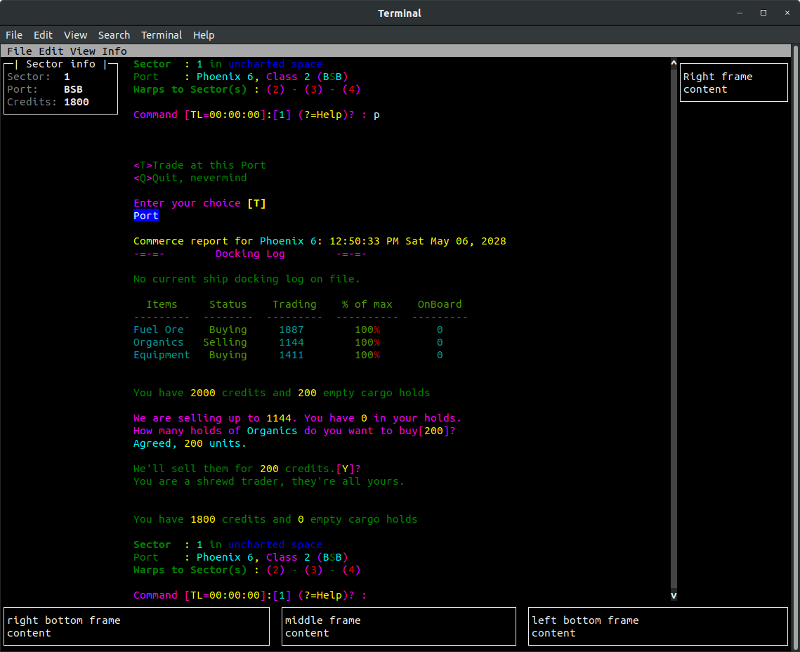

# Terminal Space - a text-based space game

This is a text-based space trading and exploration game that was inspired by
[TradeWars 2002](http://tradewars.com) and several other space trading, elite-type games.

## Features

1. Full screen text-based interface
2. Single and multi-player modes (with standalone server)
3. TradeWars 2002 concepts like sectors, planets, ports, and ships

It currently implements the TradeWars basics of a universe, sectors, and ports, 
but will soon be taken in new directions.

## Installation

To run it, install Python 3.7 and run:

    pip3 install terminal-space

## Running the game

With the game installed, simply run

    tspace-client

To run the server standalone (needed for the "Join Game" option), run:

    tspace-server
    
## Development 

To install it locally, run:

    make virtualenv
    source venv/bin/activate
 
To run the client, type:

    make run
    
You can see all the possible commands by running:

    make 
    
Development is often streamed on my [Twitch stream](https://www.twitch.tv/mrdonbrown/)